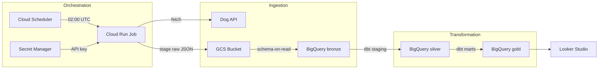
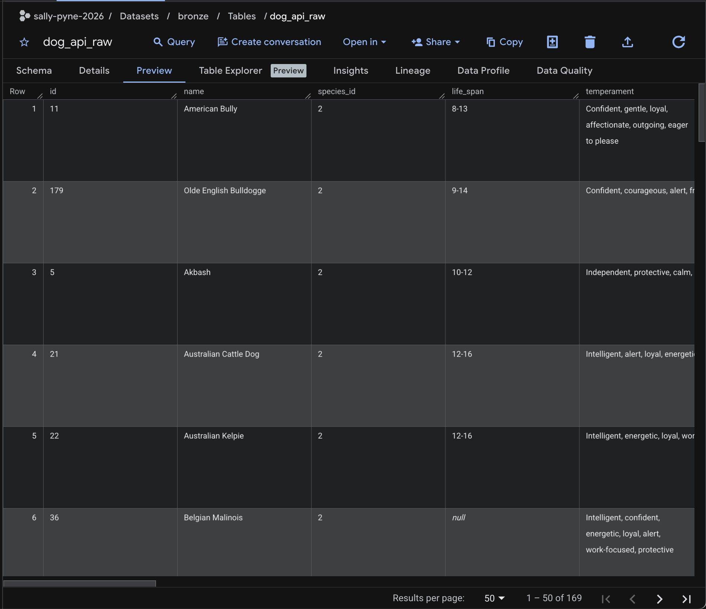
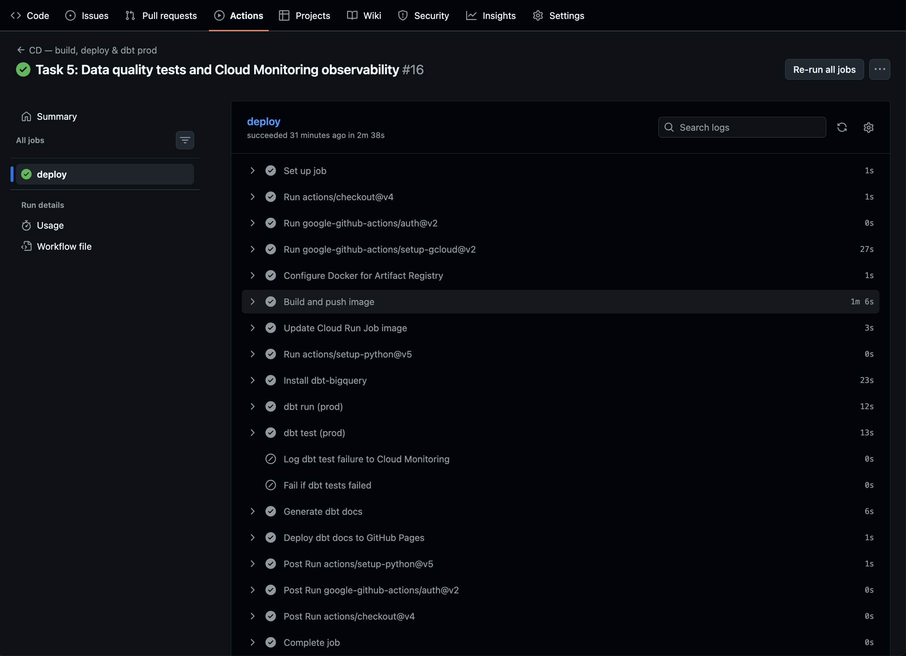

# Dog Breed Explorer — Data Engineering Case Study

**Project ID:** sally-pyne-2026

**Repository:** [sallylynne/dog-breed-explorer](https://github.com/sallylynne/dog-breed-explorer)


**dbt docs:** https://sallylynne.github.io/dog-breed-explorer/

**Dashboard:** https://lookerstudio.google.com/s/juYH956Ggv8

---

## Architecture Overview



| Layer | GCP Resource | dbt Dataset (dev) | dbt Dataset (prod) |
|---|---|---|---|
| Bronze | GCS bucket + BigQuery `bronze` | — | — |
| Silver | — | `dev_silver` | `silver` |
| Gold | — | `dev_gold` | `gold` |

Infrastructure is managed with Terraform. The ingestion pipeline runs as a Cloud Run Job triggered daily by Cloud Scheduler.

---

## Pipeline Output

### Bronze — raw ingestion (`bronze.dog_api_raw`)


### CD — successful build


---

## Bootstrap Instructions

### Prerequisites
- GCP project with billing enabled
- `gcloud` CLI authenticated (`gcloud auth login`)
- `terraform` CLI installed
- `uv` Python package manager

### 1. Clone the repo

```bash
git clone https://github.com/sallylynne/dog-breed-explorer.git
cd dog-breed-explorer
```

### 2. Install Python dependencies

```bash
uv sync
```

### 3. GCP credentials

Place your `gcp-key.json` service account key in the project root (it is git-ignored):

```bash
export GOOGLE_APPLICATION_CREDENTIALS="gcp-key.json"
```

### 4. Create the Dog API secret

Store your Dog API key in Secret Manager (Terraform references this secret; it must exist before `terraform apply`):

```bash
gcloud secrets create dog-api-key \
  --replication-policy=automatic \
  --project=sally-pyne-2026
echo -n "YOUR_DOG_API_KEY" | gcloud secrets versions add dog-api-key --data-file=-
```

Get a free API key at https://thedogapi.com.

### 5. Provision infrastructure

```bash
terraform init
terraform apply
```

This creates the GCS bucket, BigQuery datasets (`bronze`, `silver`, `gold`), Cloud Run Job, Cloud Scheduler trigger, and Cloud Monitoring alerting resources.

### 6. Build and push the ingestion image

```bash
gcloud auth configure-docker us-central1-docker.pkg.dev --quiet
docker build -t us-central1-docker.pkg.dev/sally-pyne-2026/cloud-run-source-deploy/dog-ingestion-job:latest .
docker push us-central1-docker.pkg.dev/sally-pyne-2026/cloud-run-source-deploy/dog-ingestion-job:latest
```

### 7. Run the ingestion pipeline (ad-hoc)

```bash
uv run python dog_pipeline.py
```

Or trigger the Cloud Run Job directly:

```bash
gcloud run jobs execute dog-ingestion-job --region us-central1
```

### 8. Run dbt transformations (local dev)

```bash
cd dog_transformations
uv run dbt run
uv run dbt test
```

Requires `~/.dbt/profiles.yml` to be configured with a `dog_transformations` profile pointing to your `gcp-key.json`.

---

## CI/CD (GitHub Actions)

| Workflow | Trigger | What it does |
|---|---|---|
| `ci.yml` | Pull request → `main` | Runs `dbt run` + `dbt test` in a throwaway BigQuery dataset (`dbt_ci_pr<N>`), then cleans it up |
| `cd.yml` | Push to `main` | Builds + pushes Docker image via GitHub Actions, updates the Cloud Run Job, runs `dbt run/test --target prod`, publishes dbt docs to GitHub Pages |

### Required GitHub secret

Add a secret named **`GCP_SA_KEY`** in **Settings → Secrets and variables → Actions**:

- Value: the full JSON contents of `gcp-key.json`

This is the only manual step required after cloning the repo.

---

## Findings & Business Impact

Analysis of 169 breeds from the Dog API reveals three insights for the Dog Breed Explorer product.

**Longest-lived breeds skew small.** 
The Rat Terrier leads with a predicted 15-year lifespan, followed by a cluster of smaller breeds (Miniature Poodle, Australian Cattle Dog, Australian Kelpie) at 14 years. The colour breakdown by size class shows that Toy and Small breeds dominate the longest-lived group — none of the top 15 are Giant breeds. Surfacing lifespan alongside size helps prospective owners set realistic expectations before bringing a dog home.

**The registry is dominated by large and medium breeds.** 
Large (53) and Medium (51) breeds together account for over 60% of the breeds catalogued, while Toy (21) and Giant (17) breeds are the smallest categories. This reflects the sheer variety of breeds that exist in the medium-to-large range, with Toy and Giant breeds representing more specialised ends of the size spectrum.

**Intelligence and affection define the family-friendly profile.** 
Among breeds flagged as family-friendly, "intelligent" is the most common temperament trait (88 breeds), followed by "affectionate" (61) and "friendly" (58). Loyalty and playfulness also feature strongly. Families want engaged, trainable companions as much as gentle ones. Since families represent the largest prospective owner segment, temperament data can drive personalised breed discovery and improve engagement with the explorer.

**Next steps:** 
Enriching the dataset with adoption availability and regional popularity data would unlock demand-side insights to complement the supply-side breed catalogue built here.

---

## Service Account Roles

`data-pipeline-runner@sally-pyne-2026.iam.gserviceaccount.com` holds the following roles:

| Role | Purpose |
|---|---|
| `roles/storage.objectAdmin` | Read/write GCS staging bucket |
| `roles/bigquery.dataEditor` | Read/write tables and views across Bronze, Silver, and Gold datasets |
| `roles/bigquery.jobUser` | Execute BigQuery compute jobs |
| `roles/run.invoker` | Allow Cloud Scheduler to trigger the Cloud Run Job |
| `roles/artifactregistry.writer` | Push Docker images to Artifact Registry |
| `roles/cloudbuild.builds.editor` | Submit Cloud Build jobs (manual ad-hoc builds) |
| `roles/run.developer` | Update Cloud Run Job after image push |
| `roles/iam.serviceAccountUser` (on itself) | Required to update the Cloud Run Job whose execution SA is itself |
| `roles/serviceusage.serviceUsageConsumer` | Use GCP APIs via gcloud CLI |
| `roles/secretmanager.secretAccessor` | Read the Dog API key from Secret Manager |
